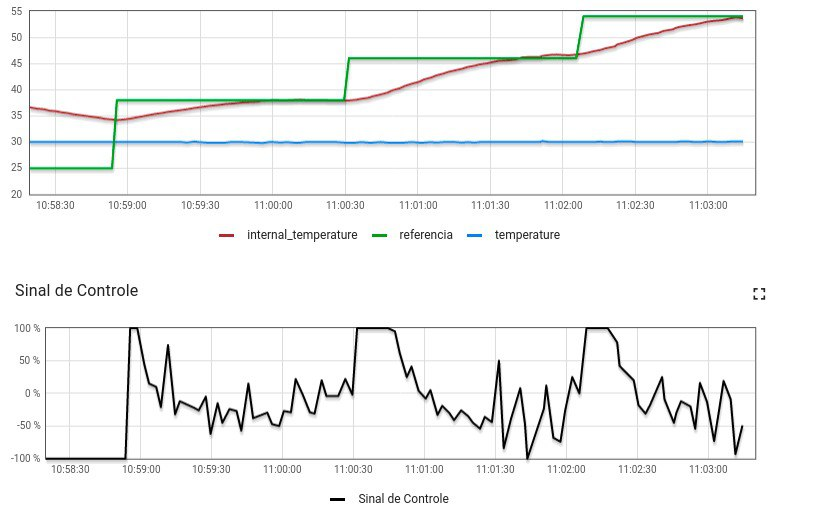

# Trabalho 2 - 2022/2 - Fundamentos de Sistemas Embarcados

Repositório de realização do trabalho 2 da matéria de Fundamentos de Sistemas Embarcados.

### Autor

**Guilherme de Morais Richter**

## Objetivo

Este trabalho tem por objetivo a implementação de um sistema que realiza o controle de um forno industrial.

## Descrição

Para a solução do projeto, o envio e solicitação de dados é realizado utilizando a comunicação serial UART-MODBUS.

- Ao executar o código, o sistema se inicia desligado e parado 
- Com o acionamento do botão 'Ligar' e em seguida do botão 'Funcionar', o forno realiza aquecimento ou resfriamento para chegar à temperatura desejada no modo 'manual', onde o usuário seleciona pela Dashboard a temperatura desejada.

### Gráfico de temperatura e dos valores de acionamento



### Log em execução no terminal


# **Requisitos**

Para executar o código necessita-se estar conectado a um ambiente de uma Raspberry Pi devidamente configurada.

### **Uso**

1. Clonar este repositório

2. Transferir toda a pasta do repositório para o servidor SSH da RASP.

3. Acessar o servidor SSH da RASP

4. Na pasta raiz do projeto no servidor SSH, bsata executar o comando:

```
make
```

5. Para finalizar a execução do programa, basta apertar CTRL+C no terminal.

### Observações

- A gravação de informações em CSV não está funcionando.
- O modo de definição de temperatura por curva não está funcionando.
